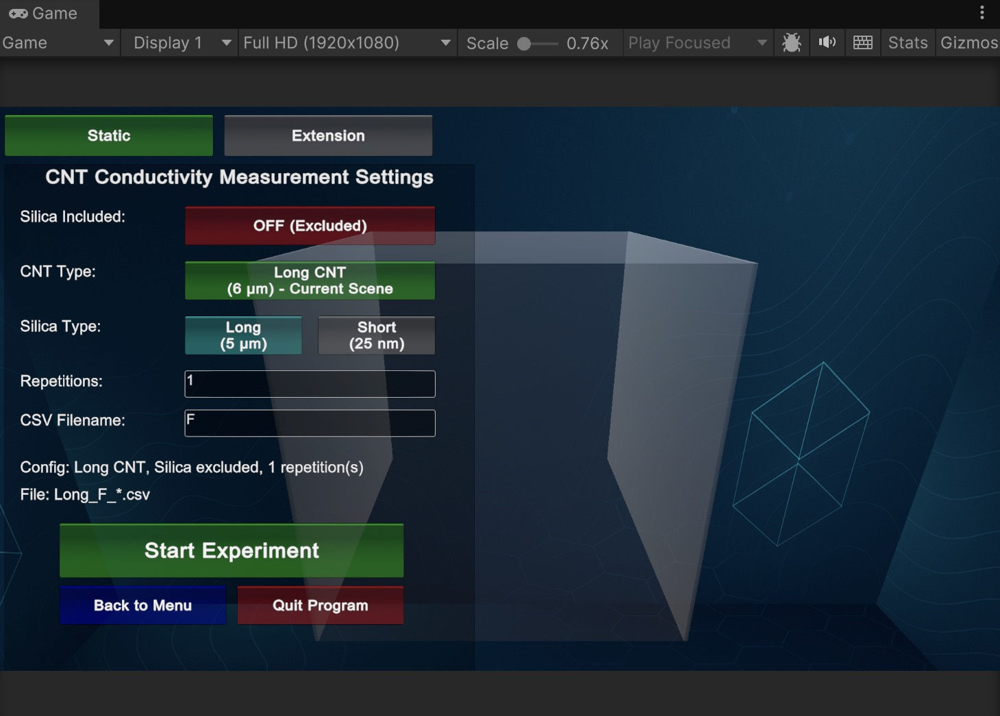
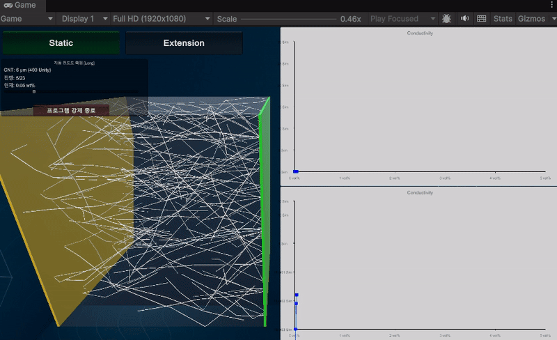
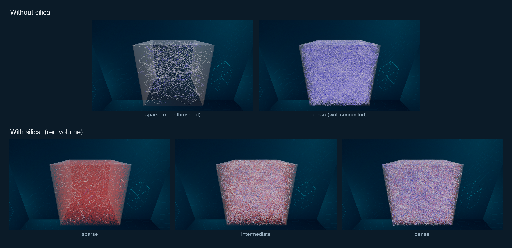
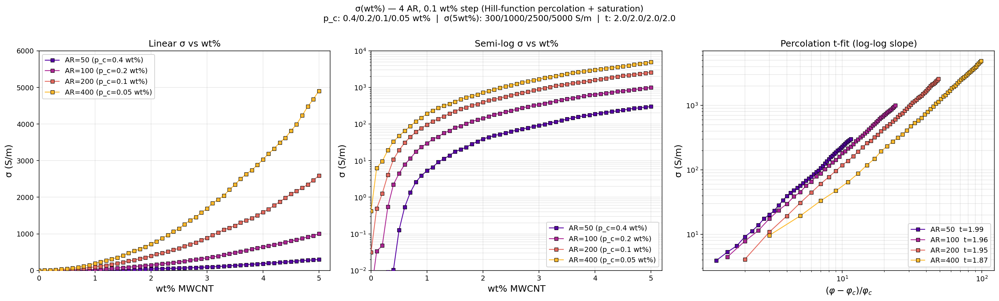
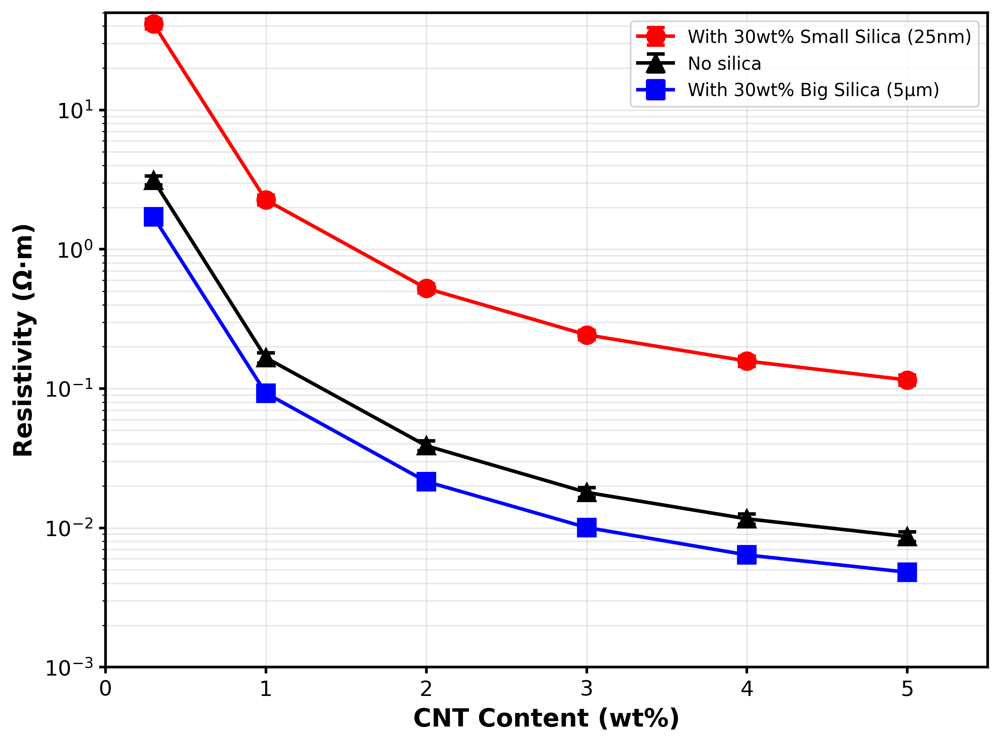
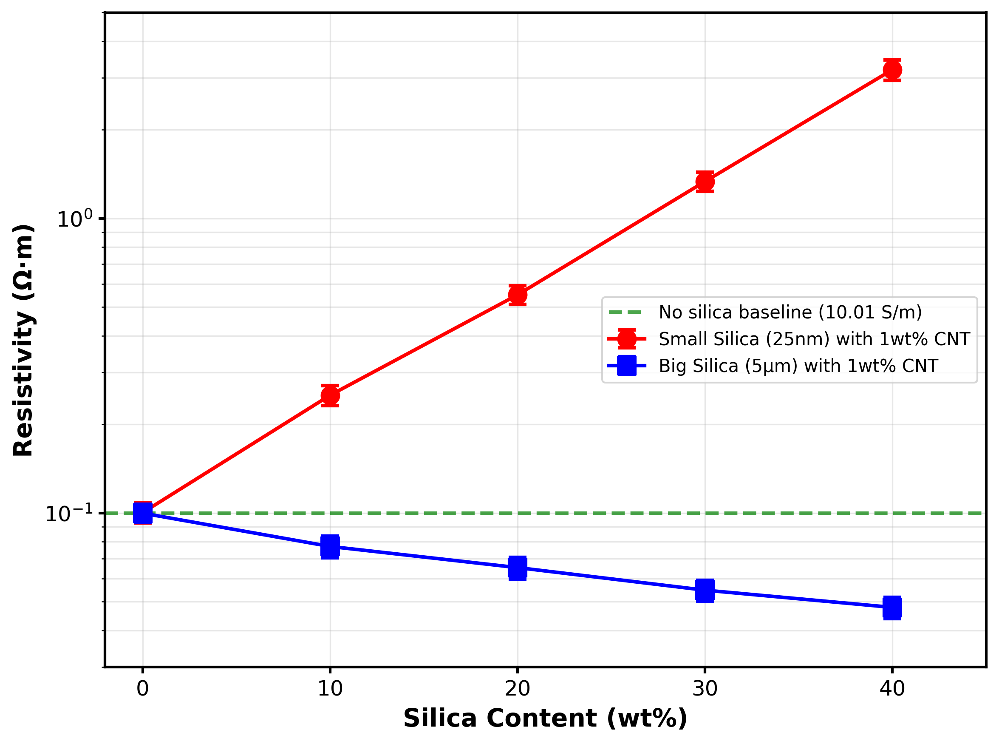
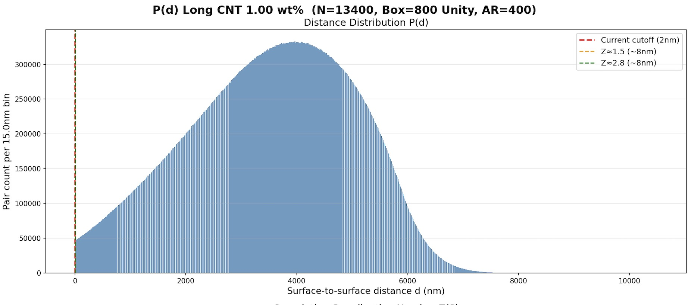

<h1 align="center">A Lightweight Game-Engine Digital Twin for Conductivity in CNT/PDMS Composites</h1>

  Static conductivity, a second silica filler, and the piezoresistive response under load — handled by one simulator on one workstation.

  <b>Seung Hyun Oh</b>, Seunggwan Oh, Kun-Woo Nam, Sung-Hoon Park, Sang Hyun Lee &nbsp;·&nbsp; Korea University &nbsp;·&nbsp; MRS Fall 2026, Symposium NM04

  <code>Unity DOTS / ECS</code> &nbsp; <code>Burst</code> &nbsp; <code>GPU compute (HLSL)</code> &nbsp; <code>C#</code>

---

We model how a carbon-nanotube (CNT) network conducts inside a PDMS rubber, and we run the whole thing on top of the Unity game engine. A game engine already places and updates millions of moving objects on an ordinary PC, so one workstation can cover cases that usually take separate codes or a cluster: the static conductivity, a second non-conducting silica filler, and the change in resistance when the material is stretched, compressed, or bent. This page collects the figures and runs behind our MRS Fall 2026 abstract.

---

## 1. How the simulator is put together

  

The path from input to output. You fix a handful of numbers — tube diameter and aspect ratio, the contact resistance, the tunnelling decay, the loading in wt%, the box size, a random seed. The model drops straight, mutually penetrable rods into the box at random positions and directions (random sequential adsorption), keeps every rod as a flat data record that all CPU cores update at once, and finds the tube-to-tube contacts on a spatial grid using the GPU. Each contact becomes a tunnelling resistor, `R = R_c · exp(κ·d)`, where `d` is the surface gap. Solving that resistor network gives the conductance `G`, and the box geometry turns it into a conductivity `σ`. Two modules branch off the same network: a silica filler that crowds the tubes, and a stretch-and-bend mode that moves them and re-solves the circuit. The outputs are the `σ`–wt% percolation curve and the piezoresistive `R/R₀` response.

---

## 2. The control panel

  

The settings screen, captured straight from the Unity Game view. You choose the CNT type (here a 6 µm "Long" tube), turn the silica filler on or off and pick its size (5 µm or 25 nm), set how many repetitions to average, and name the output CSV. "Start Experiment" launches the wt% sweep. The translucent box on the right is the simulation volume that fills up as the run proceeds.

---

## 3. A sweep, recorded live

  

A single run, recorded as it happens. As the loading climbs from 0.05 to 2 wt%, the box fills with tubes and the conductivity curve on the right is drawn one point at a time — linear on top, semi-log below. Each point is one fully solved network, and the run shown steps through twenty-three concentrations.

---

## 4. What the network looks like

The same box, before and after percolation. Near the threshold only a few tubes reach across the volume and most branches are dead ends; at higher loading the network is dense and many separate paths carry current at once. Adding a silica filler (the red volume) takes up room and pushes the tubes into the space that is left, which bends and reroutes the conducting paths.

  

---

## 5. Static conductivity

  

Conductivity against loading for four aspect ratios (50, 100, 200, 400), shown three ways: linear, semi-log, and a log–log percolation fit. The three electrical inputs are fixed across the whole set. The threshold moves from about 0.4 wt% at AR 50 down to about 0.05 wt% at AR 400 — the `1/AR` drop expected for slender fillers, and the reason a long tube needs so little material to start conducting. The fitted slope `t` sits near 2, the three-dimensional percolation value. We read the shape of the rise and this scaling from the figure; the contact resistance is what sets the absolute level.

---

## 6. How filler size moves the result

The silica modules let us change one thing at a time — the size of the second filler — and watch where the conductivity goes.

  
  &nbsp;&nbsp;
  

On the left, resistivity against CNT loading with and without 30 wt% silica. Big silica (5 µm) lowers the resistivity a little, while the same amount of small silica (25 nm) raises it: the finer powder spreads over far more surface and gets between the tubes. On the right, resistivity against silica content at a fixed 1 wt% CNT. The two sizes pull in opposite directions, and both start from the same no-silica baseline near 10 S/m.

---

## 7. Why the network stays selective

  

How close the tubes actually sit to one another. The histogram is the surface-to-surface gap between every tube pair at 1 wt% (AR 400). Only the thin sliver to the left of the 2 nm cutoff carries any tunnelling current; the great majority of pairs are microns apart and contribute nothing. A small contact resistance and a steep tunnelling decay therefore still leave a sparse, selective set of conducting junctions.

---

## What to read here, and what not to

The model takes its three electrical inputs — junction contact resistance, the tunnelling term, and the rods' own resistance — from published ranges, and holds them fixed across every run. The curves therefore show trends, scaling, and the shape of the transition, with the junction contact resistance setting the overall level, rather than a conductivity calibrated to one experiment. The rods are penetrable (soft-core), so overlaps count as van der Waals contacts instead of shorts, and the network reaches real sample loadings without the jamming that stops hard-core models.

---

  Figures are posted here for inspection. The simulator code is available on request. 
  MRS Fall 2026 · Symposium NM04 · Korea University

